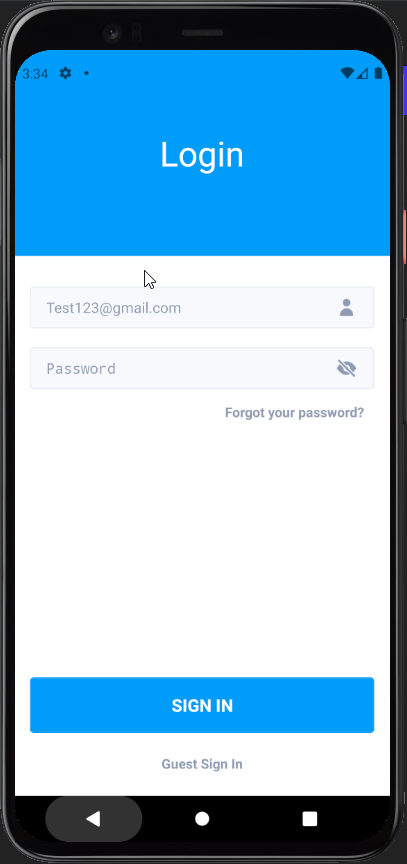

# Student Flatmate Finder Applcation

Developed using react native/expo/kitten ui 


# Running locally

1. Install the dependencies

```
$ yarn


```

2. Will need to install expo

```
$ npm install --global expo-cli
```
https://docs.expo.io/get-started/installation/

3. Start expo

```
$ yarn start
```

4. Only works for android and desktop atm 


# Figma Desgins


# Figma File
[You Will Need To Download Figma To Use](https://github.com/Benstarkie19/Flatmate-Finder-Application/blob/master/Student%20Flat%20Applcation.fig)


# Applcation Screenshots




# Applcation APK For Android 
[Working APK For Android device Or Emulator ](https://github.com/Benstarkie19/Flatmate-Finder-Application/blob/master/apk%20build/StudentFla-7f169ecd6311463a98c124aecc6e4f6c-signed.apk)
