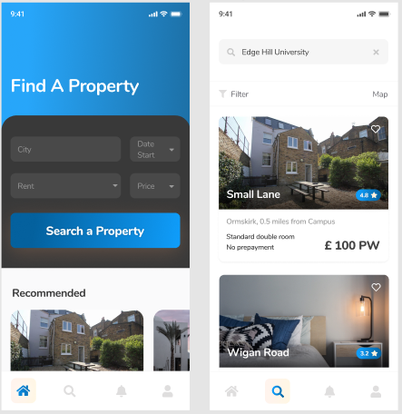

# Student Flatmate Finder Applcation

Developed using react native/expo/kitten ui 


# Running locally

1. Install the dependencies

```
$ yarn


```

2. Will need to install expo

```
$ npm install --global expo-cli
```
https://docs.expo.io/get-started/installation/

3. Start expo

```
$ yarn start
```

4. Only works for android and desktop atm 


# Features Figma Desgins



